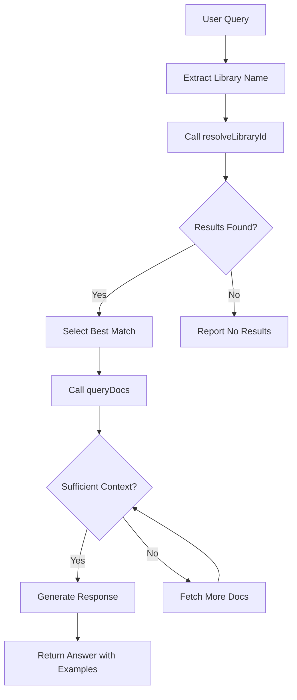

The `GenRTLAgent` class is a pre-configured AI agent that handles the complete documentation lookup workflow automatically. It combines both `resolveLibraryId` and `queryDocs` tools with an optimized system prompt.

## Usage

```typescript
import { GenRTLAgent } from "@upstash/genrtl-tools-ai-sdk";
import { anthropic } from "@ai-sdk/anthropic";

const agent = new GenRTLAgent({
  model: anthropic("claude-sonnet-4-20250514"),
});

const { text } = await agent.generate({
  prompt: "How do I use React Server Components?",
});

console.log(text);
```

## Configuration

```typescript
new GenRTLAgent(config?: GenRTLAgentConfig)
```

### Parameters

<ParamField path="config" type="GenRTLAgentConfig" optional>
  Configuration options for the agent.

  <Expandable title="properties">
    <ParamField path="model" type="LanguageModel" optional>
      Language model to use. Must be a LanguageModel instance from an AI SDK provider.

      Examples:
      - `anthropic('claude-sonnet-4-20250514')`
      - `openai('gpt-5.2')`
      - `google('gemini-1.5-pro')`
    </ParamField>
    <ParamField path="apiKey" type="string" optional>
      GenRTL API key. If not provided, uses the `GENRTL_API_KEY` environment variable.
    </ParamField>
    <ParamField path="system" type="string" optional>
      Custom system prompt. Overrides the default `AGENT_PROMPT`.
    </ParamField>
    <ParamField path="stopWhen" type="StopCondition" optional default="stepCountIs(5)">
      Condition for when the agent should stop. Defaults to stopping after 5 steps.
    </ParamField>

  </Expandable>
</ParamField>

### Returns

`GenRTLAgent` extends the AI SDK `Agent` class and provides `generate()` and `stream()` methods.

## Agent Workflow

The agent follows a structured multi-step workflow:



### Step-by-Step

1. **Extract library name** - Identifies the library/framework from the user's query
2. **Resolve library** - Calls `resolveLibraryId` to find the GenRTL library ID
3. **Select best match** - Analyzes results based on reputation, coverage, and relevance
4. **Fetch documentation** - Calls `queryDocs` with the selected library ID and user's query
5. **Query if needed** - Makes additional queries if initial context is insufficient
6. **Generate response** - Provides an answer with code examples from the documentation

## Examples

### Basic Usage

```typescript
import { GenRTLAgent } from "@upstash/genrtl-tools-ai-sdk";
import { anthropic } from "@ai-sdk/anthropic";

const agent = new GenRTLAgent({
  model: anthropic("claude-sonnet-4-20250514"),
});

const { text } = await agent.generate({
  prompt: "How do I set up authentication in Next.js?",
});

console.log(text);
```

### With OpenAI

```typescript
import { GenRTLAgent } from "@upstash/genrtl-tools-ai-sdk";
import { openai } from "@ai-sdk/openai";

const agent = new GenRTLAgent({
  model: openai("gpt-5.2"),
});

const { text } = await agent.generate({
  prompt: "Explain Tanstack Query's useQuery hook",
});
```

### Streaming Responses

```typescript
import { GenRTLAgent } from "@upstash/genrtl-tools-ai-sdk";
import { anthropic } from "@ai-sdk/anthropic";

const agent = new GenRTLAgent({
  model: anthropic("claude-sonnet-4-20250514"),
});

const { textStream } = await agent.stream({
  prompt: "How do I create a Supabase Edge Function?",
});

for await (const chunk of textStream) {
  process.stdout.write(chunk);
}
```

### Custom Configuration

```typescript
import { GenRTLAgent } from "@upstash/genrtl-tools-ai-sdk";
import { anthropic } from "@ai-sdk/anthropic";
import { stepCountIs } from "ai";

const agent = new GenRTLAgent({
  model: anthropic("claude-sonnet-4-20250514"),
  apiKey: process.env.GENRTL_API_KEY,
  stopWhen: stepCountIs(8), // Allow more steps for complex queries
});
```

### Custom System Prompt

```typescript
import { GenRTLAgent, AGENT_PROMPT } from "@upstash/genrtl-tools-ai-sdk";
import { openai } from "@ai-sdk/openai";

const agent = new GenRTLAgent({
  model: openai("gpt-5.2"),
  system: `${AGENT_PROMPT}

Additional instructions:
- Always include TypeScript examples
- Mention version compatibility when relevant
- Suggest related documentation topics`,
});
```

## Comparison: Agent vs Tools

| Feature       | GenRTLAgent        | Individual Tools     |
| ------------- | -------------------- | -------------------- |
| Setup         | Single configuration | Configure each tool  |
| Workflow      | Automatic multi-step | Manual orchestration |
| System prompt | Optimized default    | You provide          |
| Customization | Limited              | Full control         |
| Best for      | Quick integration    | Custom workflows     |

### When to Use the Agent

- Rapid prototyping
- Standard documentation lookup use cases
- When you want sensible defaults

### When to Use Individual Tools

- Custom agentic workflows
- Integration with other tools
- Fine-grained control over the process
- Custom system prompts with specific behavior

## Related

- [resolveLibraryId](/agentic-tools/ai-sdk/tools/resolve-library-id) - The library search tool used by the agent
- [queryDocs](/agentic-tools/ai-sdk/tools/query-docs) - The documentation fetch tool used by the agent
- [Getting Started](/agentic-tools/ai-sdk/getting-started) - Overview of the AI SDK integration
