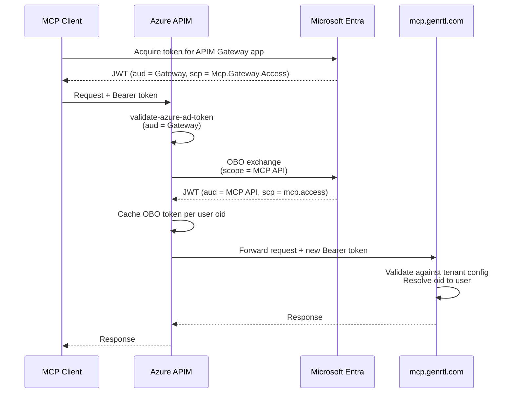

This guide walks through deploying Azure API Management (APIM) as a gateway in front of `mcp.genrtl.com`, with per-user authentication backed by your Microsoft Entra tenant. Developers sign in once with their corporate Entra account in their MCP client (for example VS Code with GitHub Copilot), and every request to GenRTL is attributed to that individual through the `oid` claim on their Entra access token.

The gateway uses an On-Behalf-Of (OBO) flow: clients acquire a token for the APIM gateway, APIM exchanges it via Entra for a token targeting your MCP API, and the resulting token is forwarded to `mcp.genrtl.com`. GenRTL validates the token against your tenant configuration and resolves the user. APIM remains the network and audit boundary; MFA and Conditional Access continue to be enforced by Entra at sign-in.

## Architecture



## Before you start

You will need:

- An **Azure subscription** in the same tenant as your Entra users.
- A **Microsoft Entra admin** who can register applications and grant tenant-wide consent.
- A **GenRTL enterprise teamspace**. The dashboard surfaces the Entra ID configuration card only for enterprise and enterprise-trial teamspaces.
- The **Azure CLI** installed locally (`brew install azure-cli` on macOS) and authenticated with `az login`.

Plan for about 45 to 60 minutes end-to-end on a clean Azure subscription.

## Part 1: Provision API Management

APIM Basic v2 provisions in about 5 minutes and supports MCP routing. Consumption tier does **not** support MCP backends.

Create a Bicep file:

```bicep apim.bicep
param name string
param location string
param publisherEmail string
param publisherName string

resource apim 'Microsoft.ApiManagement/service@2024-05-01' = {
  name: name
  location: location
  sku: {
    name: 'BasicV2'
    capacity: 1
  }
  properties: {
    publisherEmail: publisherEmail
    publisherName: publisherName
  }
}

output gatewayUrl string = apim.properties.gatewayUrl
```

Deploy it:

```bash
RG=rg-genrtl-mcp
LOC=westeurope
APIM=apim-genrtl-$(openssl rand -hex 3)

az group create -n $RG -l $LOC
az deployment group create -g $RG --template-file apim.bicep \
  --parameters name=$APIM location=$LOC \
    publisherEmail=you@example.com publisherName="Your Org"
```

Capture the gateway URL:

```bash
APIM_HOST=$(az apim show -g $RG -n $APIM --query gatewayUrl -o tsv)
echo $APIM_HOST  # https://<apim-name>.azure-api.net
```

## Part 2: Register Entra applications

Two Entra app registrations are required: one representing the MCP API (the protected resource), and one representing the APIM gateway (the OBO intermediary).

### Step 1: Register the MCP API app

This app represents GenRTL's MCP server in your tenant. Issued tokens will carry its Application (client) ID as the `aud` claim.

1. **Microsoft Entra admin center** → **App registrations** → **+ New registration**.
   - **Name:** `GenRTL MCP API`
   - **Supported account types:** Single tenant only (formerly labelled "Accounts in this organizational directory only")
   - **Redirect URI:** leave blank
   - **Register**

2. Copy the **Application (client) ID** from the Overview page. You will provide it to GenRTL in Part 4.

3. **Expose an API** → **Add** next to "Application ID URI" → accept the default `api://<client-id>` → **Save**.

4. **+ Add a scope**:
   - **Scope name:** `mcp.access`
   - **Who can consent:** Admins and users
   - **Admin consent display name:** `Access GenRTL MCP server`
   - **State:** Enabled
   - **Add scope**

5. **Manifest** → set `requestedAccessTokenVersion: 2` under the `api` object. Save.

   <Warning>
   This forces v2 tokens with `iss: https://login.microsoftonline.com/<tenant-id>/v2.0`. v1 tokens use a different issuer and fail validation at the GenRTL backend.
   </Warning>

### Step 2: Register the APIM Gateway app

This app represents the gateway as an Entra resource. Clients request tokens for it; APIM exchanges them for MCP API tokens.

1. **App registrations** → **+ New registration**.
   - **Name:** `GenRTL APIM Gateway`
   - **Supported account types:** Single tenant only (formerly labelled "Accounts in this organizational directory only")
   - **Register**

2. Copy the **Application (client) ID** and **Directory (tenant) ID** from the Overview page.

3. **Certificates & secrets** → **+ New client secret** → set an expiry → **Add**. Copy the **Value** column immediately; it is only shown once.

4. **Expose an API** → **Add** next to "Application ID URI" → accept the default → **Save**.

5. **+ Add a scope**:
   - **Scope name:** `Mcp.Gateway.Access`
   - **Who can consent:** Admins and users
   - **State:** Enabled
   - **Add scope**

6. **Manifest** → set `requestedAccessTokenVersion: 2`. Save.

### Step 3: Wire the permission chain

The APIM Gateway app must be allowed to call the MCP API on a user's behalf, and the MCP client tools must be allowed to call the Gateway.

In the **GenRTL APIM Gateway** app:

1. **API permissions** → **+ Add a permission** → **My APIs** → `GenRTL MCP API` → **Delegated permissions** → check `mcp.access` → **Add permissions**.
2. Click **Grant admin consent for `<your tenant>`** at the top of the permissions table.
3. **Expose an API** → **Authorized client applications** → **+ Add a client application**. For each MCP client tool you want to allow, add its client ID and tick the `Mcp.Gateway.Access` scope:
   - **VS Code with GitHub Copilot:** `aebc6443-996d-45c2-90f0-388ff96faa56` (Microsoft's well-known VS Code client ID).
   - **Other tools:** check the tool's documentation for its published OAuth client ID.

In the **GenRTL MCP API** app:

1. **Expose an API** → **Authorized client applications** → **+ Add a client application**. Add the **GenRTL APIM Gateway** app's client ID and tick the `mcp.access` scope. This skips the end-user consent prompt during the OBO exchange.

## Part 3: Configure API Management

### Step 1: Store credentials as named values

```bash
az apim nv create -g $RG --service-name $APIM \
  --named-value-id entra-tenant-id \
  --display-name entra-tenant-id \
  --value "<your-tenant-id>"

az apim nv create -g $RG --service-name $APIM \
  --named-value-id apim-gateway-app-id \
  --display-name apim-gateway-app-id \
  --value "<apim-gateway-app-client-id>"

az apim nv create -g $RG --service-name $APIM \
  --named-value-id apim-gateway-client-secret \
  --display-name apim-gateway-client-secret \
  --value "<apim-gateway-client-secret>" \
  --secret true

az apim nv create -g $RG --service-name $APIM \
  --named-value-id mcp-api-app-id \
  --display-name mcp-api-app-id \
  --value "<mcp-api-app-client-id>"
```

<Tip>
For production, back the client secret with Azure Key Vault rather than storing the value inline. Update the named value to reference a Key Vault secret and grant APIM's managed identity `get` access to the vault.
</Tip>

### Step 2: Create the API and the MCP operation

```bash
az apim api create -g $RG --service-name $APIM \
  --api-id genrtl-mcp \
  --display-name "GenRTL MCP" \
  --path genrtl \
  --service-url https://mcp.genrtl.com \
  --protocols https \
  --subscription-required false

az apim api operation create -g $RG --service-name $APIM \
  --api-id genrtl-mcp \
  --operation-id post-mcp \
  --display-name "MCP" \
  --method POST \
  --url-template "/mcp"
```

### Step 3: Attach the OBO policy

Save the following as `policy.xml`:

```xml policy.xml
<policies>
  <inbound>
    <base />

    <validate-azure-ad-token tenant-id="{{entra-tenant-id}}"
        header-name="Authorization"
        failed-validation-httpcode="401"
        failed-validation-error-message="Unauthorized.">
      <audiences>
        <audience>{{apim-gateway-app-id}}</audience>
      </audiences>
      <required-claims>
        <claim name="scp" match="any">
          <value>Mcp.Gateway.Access</value>
        </claim>
      </required-claims>
    </validate-azure-ad-token>

    <set-variable name="entraTenantId" value="{{entra-tenant-id}}" />
    <set-variable name="gatewayAppId" value="{{apim-gateway-app-id}}" />
    <set-variable name="gatewaySecret" value="{{apim-gateway-client-secret}}" />
    <set-variable name="mcpApiAppId" value="{{mcp-api-app-id}}" />

    <set-variable name="userOid" value="@{
      var auth = context.Request.Headers.GetValueOrDefault(&quot;Authorization&quot;, &quot;&quot;);
      var token = auth.StartsWith(&quot;Bearer &quot;) ? auth.Substring(7) : auth;
      return (string)token.AsJwt().Claims.GetValueOrDefault(&quot;oid&quot;, &quot;&quot;);
    }" />

    <cache-lookup-value
        key="@(&quot;obo-mcp-&quot; + (string)context.Variables[&quot;userOid&quot;])"
        variable-name="oboToken" />

    <choose>
      <when condition="@(!context.Variables.ContainsKey(&quot;oboToken&quot;))">
        <send-request mode="new" response-variable-name="oboResponse" timeout="20" ignore-error="false">
          <set-url>@("https://login.microsoftonline.com/" + (string)context.Variables["entraTenantId"] + "/oauth2/v2.0/token")</set-url>
          <set-method>POST</set-method>
          <set-header name="Content-Type" exists-action="override">
            <value>application/x-www-form-urlencoded</value>
          </set-header>
          <set-body>@{
            var auth = context.Request.Headers.GetValueOrDefault("Authorization", "");
            var inbound = auth.StartsWith("Bearer ") ? auth.Substring(7) : auth;
            var pairs = new System.Collections.Generic.Dictionary&lt;string, string&gt; {
              { "grant_type", "urn:ietf:params:oauth:grant-type:jwt-bearer" },
              { "client_id", (string)context.Variables["gatewayAppId"] },
              { "client_secret", (string)context.Variables["gatewaySecret"] },
              { "assertion", inbound },
              { "scope", "api://" + (string)context.Variables["mcpApiAppId"] + "/.default" },
              { "requested_token_use", "on_behalf_of" }
            };
            var parts = new System.Collections.Generic.List&lt;string&gt;();
            foreach (var kv in pairs) {
              parts.Add(System.Net.WebUtility.UrlEncode(kv.Key) + "=" + System.Net.WebUtility.UrlEncode(kv.Value));
            }
            return string.Join("&amp;", parts);
          }</set-body>
        </send-request>

        <set-variable name="oboToken" value="@{
          var resp = ((IResponse)context.Variables[&quot;oboResponse&quot;]).Body.As&lt;JObject&gt;();
          return (string)resp[&quot;access_token&quot;];
        }" />

        <cache-store-value
            key="@(&quot;obo-mcp-&quot; + (string)context.Variables[&quot;userOid&quot;])"
            value="@((string)context.Variables[&quot;oboToken&quot;])"
            duration="3000" />
      </when>
    </choose>

    <set-header name="Authorization" exists-action="override">
      <value>@(&quot;Bearer &quot; + (string)context.Variables[&quot;oboToken&quot;])</value>
    </set-header>
    <rewrite-uri template="/mcp/oauth" />
  </inbound>
  <backend>
    <base />
  </backend>
  <outbound>
    <base />
  </outbound>
  <on-error>
    <base />
  </on-error>
</policies>
```

<Note>
Two XML quirks the policy works around:

1. **Named values do not substitute inside policy expressions.** `{{...}}` is substituted by APIM only in plain element/attribute text. References inside a `@{...}` or `@(...)` expression are treated as literal C# strings. Pull each named value into a `context.Variables` slot with an attribute-form `<set-variable name="..." value="{{...}}" />` block, then reference the variable inside the expression.
2. **Attribute values cannot contain raw `"`, `<`, `>`, or `&`.** Use `&quot;`, `&lt;`, `&gt;`, `&amp;` in attribute-form expressions. Element content (like `<set-body>`) only needs to escape `<`, `>`, and `&`; double quotes are fine. CDATA sections also avoid escaping but disable named-value substitution, so prefer plain element content with escapes.
</Note>

Apply it via the management REST API. `jq` wraps the policy XML in the JSON envelope the management API expects, written to `policy-body.json`:

```bash
SUB=$(az account show --query id -o tsv)

jq -Rs '{properties: {value: ., format: "xml"}}' policy.xml > policy-body.json

az rest --method put \
  --uri "https://management.azure.com/subscriptions/$SUB/resourceGroups/$RG/providers/Microsoft.ApiManagement/service/$APIM/apis/genrtl-mcp/policies/policy?api-version=2024-05-01" \
  --body @policy-body.json
```

<Note>
The cache duration (`3000` seconds) is slightly below Entra's default access token lifetime of one hour. Adjust if your Conditional Access policies issue shorter-lived tokens. The cache key includes the `oid` claim so each user's OBO token is isolated.
</Note>

## Part 4: Onboard your tenant in GenRTL

GenRTL validates inbound tokens in two stages: first the token's signature, audience, issuer, and scope are checked against your teamspace's tenant configuration; then the token's `oid` claim is resolved against a list of pre-provisioned users for the teamspace. **Both checks are mandatory** — there is no auto-provisioning, so any developer who has not been added to the teamspace's user list will be rejected with `401` even when their token is otherwise valid.

An owner or admin of the teamspace configures both from the dashboard.

### Step 1: Configure the tenant

1. Sign in to [genrtl.com/dashboard](https://genrtl.com/dashboard) and select the teamspace that will own the integration.
2. **Settings** tab → **Microsoft Entra ID** card → **Configure**.

   <Note>
   The Settings tab itself is visible only for enterprise teamspaces and active enterprise trials. If you don't see it, confirm the selected teamspace is on an enterprise plan.
   </Note>

3. Fill in:
   - **Tenant ID** — your Entra directory ID
   - **Audience** — the **MCP API app** Application (client) ID (the second token's audience, not the gateway app)
   - **Required scope** — `mcp.access`

4. Click **Test connection**. GenRTL fetches your tenant's OpenID Connect discovery document from Microsoft and confirms the issuer matches.

5. **Save**.

### Step 2: Pre-provision your developers

After saving the tenant configuration, scroll down to the **Microsoft Entra ID users** card on the same Settings tab. This is where you list every Entra user who should be able to authenticate to the teamspace through APIM.

1. Click **Add user**.
2. Enter the user's:
   - **Email** — the address they sign in to Entra with.
   - **Object ID (oid)** — their Entra object ID. Find it in the Entra admin center under **Users → `<name>` → Overview → Object ID**, or have the user run `az ad signed-in-user show --query id -o tsv` after `az login`.
3. Click **Add user** to save.

GenRTL creates a Clerk user record for the developer, adds them as a `developer` member of the teamspace, and inserts a `(tenant, oid, teamspace)` mapping. The same email can be added to multiple teamspaces — the Clerk user is reused and a separate mapping row is created per teamspace.

<Note>
Clicking **Remove** on the Microsoft Entra ID card removes both the tenant configuration **and** all provisioned users for the teamspace in a single step. If you only need to revoke a single user, remove them from the Microsoft Entra ID users card instead.
</Note>

<Note>
Each MCP API app (audience) can be configured for **one** teamspace at a time. If you reuse an audience already claimed by a different teamspace you will see "This audience is already configured for another teamspace" — open the other teamspace's Settings tab and remove the Entra configuration there first, or register a new MCP API app for this teamspace.
</Note>

<Note>
For large rollouts (tens or hundreds of developers), CSV bulk-import and Entra SCIM provisioning are on the roadmap. Reach out to [genrtl@upstash.com](mailto:genrtl@upstash.com) if your scale needs either ahead of general availability.
</Note>

The GenRTL MCP server now accepts tokens whose `aud` matches the audience you provided, signed by your tenant's Entra issuer, with the required scope present, and whose `oid` matches one of the users you added in Step 2.

## Part 5: Expose OAuth discovery for MCP clients

For MCP clients (VS Code with GitHub Copilot, Claude Code, Cursor) to authenticate themselves without a manually-pasted Bearer token, APIM needs to advertise an OAuth 2.1 discovery surface and bridge `/authorize` and `/token` to Entra. The MCP server returns `401` with a `WWW-Authenticate` header pointing at a PRM document; clients follow the chain to obtain a token.

### Step 1: Create the OAuth proxy API at the host root

A second API in APIM at the root path hosts the well-known endpoints and the OAuth bridge:

```bash
az apim api create -g $RG --service-name $APIM \
  --api-id oauth-proxy \
  --display-name "OAuth Proxy" \
  --path "" \
  --service-url "https://login.microsoftonline.com/<your-tenant-id>/oauth2/v2.0" \
  --protocols https \
  --subscription-required false

for op in prm-metadata as-metadata authorize token; do
  case $op in
    prm-metadata) path="/.well-known/oauth-protected-resource"; method=GET ;;
    as-metadata)  path="/.well-known/oauth-authorization-server"; method=GET ;;
    authorize)    path="/authorize"; method=GET ;;
    token)        path="/token"; method=POST ;;
  esac
  az apim api operation create -g $RG --service-name $APIM \
    --api-id oauth-proxy --operation-id $op \
    --display-name "$op" --method $method --url-template "$path"
done
```

### Step 2: Attach the discovery + redirect policies

Save the three policy files:

```xml prm-policy.xml
<policies>
  <inbound>
    <return-response>
      <set-status code="200" reason="OK" />
      <set-header name="Content-Type" exists-action="override">
        <value>application/json</value>
      </set-header>
      <set-body>{
  "resource": "https://<your-apim-host>/genrtl",
  "authorization_servers": ["https://<your-apim-host>"],
  "scopes_supported": ["api://<gateway-app-id>/Mcp.Gateway.Access"],
  "bearer_methods_supported": ["header"]
}</set-body>
    </return-response>
  </inbound>
</policies>
```

```xml as-metadata-policy.xml
<policies>
  <inbound>
    <return-response>
      <set-status code="200" reason="OK" />
      <set-header name="Content-Type" exists-action="override">
        <value>application/json</value>
      </set-header>
      <set-body>{
  "issuer": "https://<your-apim-host>",
  "authorization_endpoint": "https://<your-apim-host>/authorize",
  "token_endpoint": "https://<your-apim-host>/token",
  "jwks_uri": "https://login.microsoftonline.com/<your-tenant-id>/discovery/v2.0/keys",
  "response_types_supported": ["code"],
  "grant_types_supported": ["authorization_code", "refresh_token"],
  "code_challenge_methods_supported": ["S256"],
  "token_endpoint_auth_methods_supported": ["none", "client_secret_post"],
  "scopes_supported": ["openid", "profile", "email", "offline_access", "api://<gateway-app-id>/Mcp.Gateway.Access"]
}</set-body>
    </return-response>
  </inbound>
</policies>
```

```xml authorize-policy.xml
<policies>
  <inbound>
    <return-response>
      <set-status code="302" reason="Found" />
      <set-header name="Location" exists-action="override">
        <value>@($"https://login.microsoftonline.com/<your-tenant-id>/oauth2/v2.0/authorize{context.Request.OriginalUrl.QueryString}")</value>
      </set-header>
    </return-response>
  </inbound>
</policies>
```

Apply all three:

```bash
for op in prm-metadata as-metadata authorize; do
  case $op in
    prm-metadata) file=prm-policy.xml ;;
    as-metadata) file=as-metadata-policy.xml ;;
    authorize) file=authorize-policy.xml ;;
  esac
  jq -Rs '{properties: {value: ., format: "xml"}}' $file > /tmp/body.json
  az rest --method put \
    --uri "https://management.azure.com/subscriptions/$SUB/resourceGroups/$RG/providers/Microsoft.ApiManagement/service/$APIM/apis/oauth-proxy/operations/$op/policies/policy?api-version=2024-05-01" \
    --body @/tmp/body.json
done
```

The `/token` operation needs no custom policy. APIM forwards POST `/token` to the service URL (`.../oauth2/v2.0/token`) with the form-encoded body and JSON response intact.

<Note>
We use a 302 redirect on `/authorize` rather than a transparent proxy. Microsoft's sign-in page contains relative URLs and cookies tied to `login.microsoftonline.com`; proxying the HTML breaks form submissions. The redirect lands the user's browser on Microsoft's domain directly, where the sign-in flow works normally.
</Note>

### Step 3: Add WWW-Authenticate to the MCP API on 401

Update the `<on-error>` block in the genrtl-mcp policy from Part 3 so unauthorised requests carry the discovery hint:

```xml
<on-error>
  <base />
  <choose>
    <when condition="@(context.Response.StatusCode == 401)">
      <set-header name="WWW-Authenticate" exists-action="override">
        <value>Bearer resource_metadata="https://<your-apim-host>/.well-known/oauth-protected-resource"</value>
      </set-header>
    </when>
  </choose>
</on-error>
```

Re-apply the policy with the same `az rest` command from Part 3.

### Step 4: Verify the discovery surface

```bash
curl -s "https://<your-apim-host>/.well-known/oauth-protected-resource"
curl -s "https://<your-apim-host>/.well-known/oauth-authorization-server"

curl -i -o /dev/null -w "%{http_code} -> %{redirect_url}\n" \
  "https://<your-apim-host>/authorize?client_id=<gateway-app-id>&response_type=code&redirect_uri=http%3A%2F%2F127.0.0.1%2F&code_challenge=abc&code_challenge_method=S256&scope=api%3A%2F%2F<gateway-app-id>%2FMcp.Gateway.Access&state=x"

curl -i -X POST "https://<your-apim-host>/genrtl/mcp" -d '{}' -H "Content-Type: application/json" 2>&1 | head -10
```

Expected:
- PRM and AS metadata return the JSON documents you just defined.
- `/authorize` returns `302 Found` with a `Location` header pointing at Entra's authorize endpoint.
- An unauthorised POST to `/genrtl/mcp` returns `401` with `WWW-Authenticate: Bearer resource_metadata="https://<your-apim-host>/.well-known/oauth-protected-resource"`.

## Part 6: Smoke test the gateway from CLI

Before pointing real MCP clients at the gateway, validate the full OBO flow from your terminal. This catches misconfigurations (wrong audience, missing scope, unmapped user) without involving an MCP client.

### Step 1: Authorize the Azure CLI on the Gateway app

Azure CLI's well-known client ID is `04b07795-8ddb-461a-bbee-02f9e1bf7b46`. Pre-authorize it on the Gateway app's scope so `az account get-access-token` can mint tokens:

1. Entra admin center → **App registrations** → **GenRTL APIM Gateway** → **Expose an API**.
2. Under **Authorized client applications**, click **+ Add a client application**.
3. **Client ID:** `04b07795-8ddb-461a-bbee-02f9e1bf7b46`.
4. Tick the `api://<gateway-app-id>/Mcp.Gateway.Access` scope. **Add**.

<Note>
This pre-authorization is only required for the CLI smoke test described here. End users connecting via VS Code with GitHub Copilot use Microsoft's first-party VS Code client ID, which you already pre-authorized in [Part 2 Step 3](#step-3-wire-the-permission-chain).
</Note>

### Step 2: Acquire a token and call the gateway

```bash
GATEWAY_APP_ID=<gateway-app-client-id>
APIM_HOST=<your-apim-host>

az login --tenant <your-tenant-id> --scope api://$GATEWAY_APP_ID/.default

TOKEN=$(az account get-access-token --resource api://$GATEWAY_APP_ID --query accessToken -o tsv)

curl -i -X POST "https://$APIM_HOST/genrtl/mcp" \
  -H "Authorization: Bearer $TOKEN" \
  -H "Content-Type: application/json" \
  -H "Accept: application/json, text/event-stream" \
  -d '{"jsonrpc":"2.0","method":"initialize","id":1,"params":{"protocolVersion":"2024-11-05","capabilities":{},"clientInfo":{"name":"smoke","version":"0.0.1"}}}'
```

Expected: `200 OK`, an `mcp-session-id` response header, and a Server-Sent Events body with the GenRTL server info. That confirms APIM validated your inbound token, performed the OBO exchange, forwarded the new token to `mcp.genrtl.com`, the MCP server validated it against your tenant configuration, and the request was attributed to your provisioned user.

If you get a non-200 status, decode `$TOKEN` at [jwt.io](https://jwt.io) and confirm `aud` is the Gateway app's client ID, `scp` is `Mcp.Gateway.Access`, and `oid` matches the value you added under **Microsoft Entra ID users**. See [Troubleshooting](#troubleshooting) for specific error codes.

## Part 7: Connect an MCP client

Configure your MCP client to talk to the APIM endpoint. Example for VS Code with GitHub Copilot:

`~/Library/Application Support/Code/User/mcp.json` on macOS (similar paths on Windows/Linux, or `.vscode/mcp.json` per workspace):

```json
{
  "servers": {
    "genrtl": {
      "type": "http",
      "url": "https://<your-apim-host>/genrtl/mcp"
    }
  }
}
```

Reload VS Code. The first time GitHub Copilot uses the server, the OAuth flow runs:

1. VS Code calls `/genrtl/mcp` with no token. APIM returns `401` with the `WWW-Authenticate` header.
2. VS Code follows the PRM, then the AS metadata.
3. VS Code attempts Dynamic Client Registration. Because Entra ID does not implement RFC 7591, the request fails and VS Code shows a dialog: **"Dynamic Client Registration not supported. Do you want to proceed by manually providing a client registration?"**
4. Click **Copy URIs & Proceed**, then paste the **APIM Gateway app's Application (client) ID** when prompted. (This is the same app whose client secret APIM uses for the OBO call.)
5. A browser window opens. The URL bar should switch to `login.microsoftonline.com/...` after APIM's 302 redirect. Sign in with your Entra account and accept the `Mcp.Gateway.Access` consent.
6. The browser redirects to a localhost loopback URI that VS Code is listening on. VS Code captures the auth code.
7. VS Code exchanges the code at APIM's `/token` endpoint, which forwards the request to Entra. Entra returns an access token whose audience is the Gateway app.
8. VS Code calls `/genrtl/mcp` with the new token. APIM validates it, performs the OBO exchange to mint an MCP-API-audience token, and forwards to GenRTL.
9. The MCP server validates the OBO token against your tenant configuration and serves the request as the signed-in user.

Trigger a Copilot Chat tool call ("use genrtl to resolve the library id for Next.js") to verify the integration.

<Note>
The manual client ID step is required because Entra ID doesn't implement RFC 7591 Dynamic Client Registration. You can document the Gateway app's client ID in your internal onboarding guide and rotate it on the normal app-registration lifecycle. Microsoft's first-party VS Code client ID (`aebc6443-996d-45c2-90f0-388ff96faa56`) can also be used by pre-authorising it on the Gateway scope, but the Gateway app's own client ID is the most consistent path because PKCE removes the need for a client secret on the user-facing side.
</Note>

## End-to-end token claims

The flow produces two distinct tokens, both issued by your Entra tenant for the same user:

| Hop | `iss` | `aud` | `oid` | `scp` |
|---|---|---|---|---|
| Client → APIM | `https://login.microsoftonline.com/<tid>/v2.0` | `<apim-gateway-app-id>` | user's Entra object ID | `Mcp.Gateway.Access` |
| APIM → GenRTL (after OBO) | `https://login.microsoftonline.com/<tid>/v2.0` | `<mcp-api-app-id>` | user's Entra object ID | `mcp.access` |

GenRTL validates the second token against your dashboard configuration and resolves `oid` to a user in your teamspace.

## Troubleshooting

### `401 Unauthorized` at APIM

The inbound token failed `validate-azure-ad-token`. Decode it at [jwt.io](https://jwt.io) and check:

- `iss` is `https://login.microsoftonline.com/<your-tenant-id>/v2.0`. If it is `https://sts.windows.net/<tid>/`, the APIM Gateway app's manifest needs `requestedAccessTokenVersion: 2`.
- `aud` equals the **APIM Gateway** app's client ID, not the MCP API app's.
- `scp` contains `Mcp.Gateway.Access`.
- `exp` is in the future.

### OBO exchange returns `AADSTS50013` or `AADSTS65001`

The APIM Gateway app is not authorised to call the MCP API on a user's behalf. In the APIM Gateway app, verify the **API permissions** tab lists `GenRTL MCP API → mcp.access (Delegated)` with **Granted for `<your tenant>`**. If admin consent has not been granted, run **Grant admin consent**.

### OBO exchange returns `AADSTS70011: Invalid scope`

The `scope` parameter in the OBO request is malformed. Verify that the `mcp-api-app-id` named value contains the **MCP API** app's client ID (a GUID) and that the policy expression renders `api://<guid>/.default`.

### `401 Unauthorized` from GenRTL with a valid OBO token

Either the token does not match the teamspace's tenant configuration, or the user is not on the teamspace's pre-provisioned list.

First open **Settings → Microsoft Entra ID** in the dashboard and verify:

- **Tenant ID** matches the OBO token's `tid` claim.
- **Audience** matches the OBO token's `aud` claim exactly (case-sensitive, GUID form for v2 tokens).
- **Required scope** matches a value in the token's `scp` claim.

Use **Test connection** to confirm the tenant is reachable.

If the tenant config is correct, the user's `oid` is probably not in the teamspace's provisioned users list. Decode the OBO token at [jwt.io](https://jwt.io) and copy the `oid` claim, then check that exact value appears in **Settings → Microsoft Entra ID users**. If it's missing, add the user (see Part 4 Step 2).

### Streaming responses get cut off

APIM diagnostics with "Number of payload bytes to log" set above zero truncate MCP's Server-Sent Events stream. Set Frontend Response payload logging to `0` at the service level.

### Wrong client ID returned to MCP clients

If a client signs in but receives `AADSTS65005: The resource is disabled` or similar, the client's app ID is not in the APIM Gateway app's **Authorized client applications** list for the `Mcp.Gateway.Access` scope. Add it explicitly.

## What this does not cover

- **Self-hosted MCP server.** This guide proxies the hosted `mcp.genrtl.com`. For air-gapped or compliance scenarios where MCP traffic cannot leave your network, contact [genrtl@upstash.com](mailto:genrtl@upstash.com).
- **Dynamic Client Registration.** Entra does not implement RFC 7591. Each approved MCP client must be pre-registered (or use a Microsoft first-party client ID) and pre-authorized on the APIM Gateway app's scope.
- **Group-based authorization at GenRTL.** GenRTL resolves the `oid` claim to a user record and authorises against teamspace membership. Group-based policies inside GenRTL (for example, restricting which Entra group can use which libraries) are not configured by this guide; reach out if your team needs that level of control.
